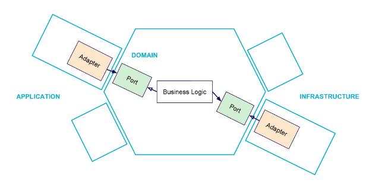

#  Model training for car residual value estimation
### Version: 0.2
    date: 2023-04-21
        Load dataset (update )
        Preprocess dataset (update)
        optimize hyperparameters (new)
        Train model (new)
        Evaluate model (new)
        Save model (new)
        Save logs (new)
    

This project provides a template for structuring a Machine Learning model training project 
using the hexagonal architecture also known as Ports and Adapters. It is designed to be flexible and reusable, allowing for 
easy integration with various Machine Learning libraries and diverse data sources. 
It is applied to the case of the residual value estimation project. \
This version is an example of training a model with a Ridge regression algorithm and GridSearchCV for hyperparameters optimization.

- [Hexagonal Architecture](#architecture-hexagonale)
- [Features](#fonctionnalités)
- [Installation](#installation)
- [Usage](#utilisation)

## Hexagonal Architecture 
*Reference:*  https://github.com/JonathanM2ndoza/Hexagonal-Architecture-DDD

The hexagonal architecture, or ports and adapters architecture, is an architectural pattern used in software design. It aims at creating loosely coupled application components that can be easily connected to their software environment by means of ports and adapters. This makes components exchangeable at any level and facilitates test automation.

The business logic interacts with other components through ports and adapters. This way, we can change the underlying technologies without having to modify the application core.

**The hexagonal architecture is based on three principles and techniques:**

1. Explicitly separate Application, Domain, and Infrastructure
2. Dependencies are going from Application and Infrastructure to the Domain
3. We isolate the boundaries by using Ports and Adapters

Note: The words Application, Domain and Infrastructure do not come from the original article but from the frequent use of hexagonal architecture by Domain-Driven Design practitioners. 

**Note: A port in Java is an interface. An adapter is one implementation of that interface.**

### Domain Layer, in the center

- The domain layer represents the inside of the application and provides ports to interact with application use cases (business logic).

- This is the part that we want to isolate from both left and right sides. It contains all the code that concerns and implements business logic (use cases).
 
- Because domain objects have no dependencies on other layers of the application, changes in other layers don’t affect them.

### Application Layer, on the left

- The application layer provides different adapters for outside entities to interact with the domain through the port.

- This is the side through which the user or external programs will interact with the application. It contains the code that allows these interactions. Typically, your user interface code, your HTTP routes for an API, your JSON serializations to programs that consume your application are here.

### Infrastructure Layer, on the right

- Provide adapters and server-side logic to interact with the application from the right side. Server-side entities, such as a database or other run-time devices, use these adapters to interact with the domain.

- It contains essential infrastructure details such as the code that interacts with your database, makes calls to the file system, or code that handles HTTP calls to other applications on which you depend for example.

##  Features 

- Flexibility to integrate different Machine Learning frameworks (e.g., scikit-learn, PyTorch)
- Integration with various data sources (e.g., CSV files, pickle files, databases, ...)
- Management of configuration parameters through configuration files
- Optimization of model hyperparameters
- Model training
- Model evaluation and saving
- Logging.

## Installation 

To install project dependencies, run the following command:

    pip install -r requirements.txt

## Usage 
1 - Configure the data source parameters in the ***config.ini*** and config.py files.

2- Run the training script to train the model:
    
        python main.py

